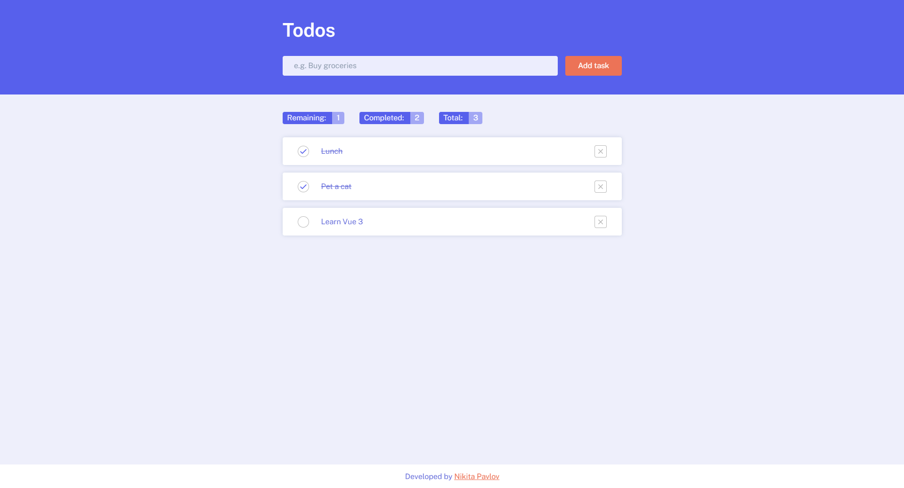

# Базовое придложение TODO на JS

- В качестве сборщика использовался Vite
- Препроцессоры: SASS, POSTCSS

## Установка

1. Установить пакеты и зависимости комнадой **npm i**
2. Запустить vite-сборку командой **npm run dev**
